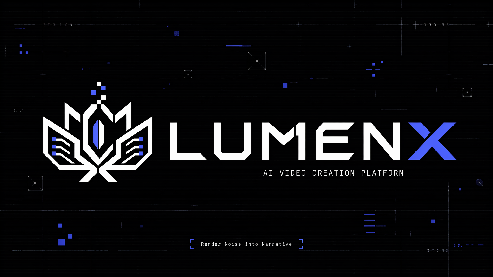
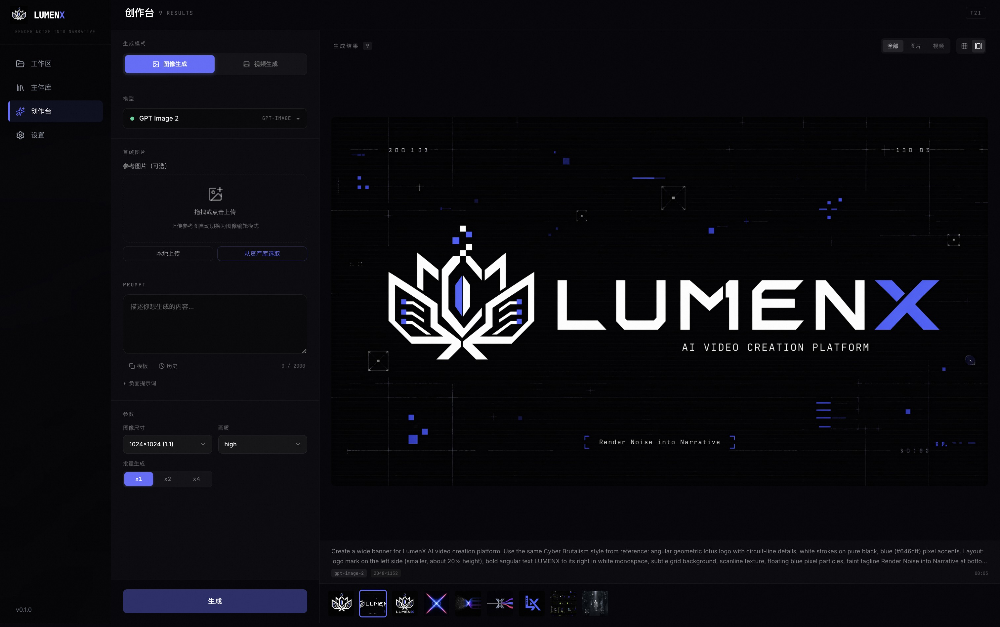

<!-- Banner -->
<div align="center">
  
</div>

<div align="center">

# LumenX

### AI-Native Motion Comic & Video Creation Platform
**Render Noise into Narrative**

[](LICENSE)
[](https://www.python.org/)
[](https://nodejs.org/)
[](https://github.com/alibaba/lumenx)

[English](README_EN.md) · [中文](README.md) · [Changelog](CHANGELOG.md) · [Contributing](CONTRIBUTING.md)

</div>

---

LumenX 是一个 **AI 原生的短漫剧 & 视频创作平台**。它将创意文本转化为可发布的动态视频，提供从剧本分析到成片导出的完整创作链路，同时支持独立的图像/视频生成能力。

LumenX 目前包含两个核心模块：

| 模块 | 定位 |
|------|------|
| **LumenX Studio** | Pipeline-first 漫剧/视频生产（剧本→分镜→资产→视频→合成→导出） |
| **LumenX Playground** | 独立图像/视频生成工具台（无需剧本上下文，即开即用） |

---

## ✨ 核心能力

<table>
<tr>
<td width="50%">

### 🎬 Studio — 全链路漫剧生产

- **深度剧本分析** — LLM 自动提取角色/场景/道具，生成结构化分镜脚本
- **可控美术指导** — 自定义视觉风格，全片画风统一
- **New API 资产生成** — 角色三视图、场景定调图、道具参考图
- **AI 分镜视频** — Seedance 文生视频与单图图生视频 + 批量抽卡
- **音频制作** — 本地 Demucs 分离与 FFmpeg 合成
- **一键合成导出** — 时间线编辑 + FFmpeg 拼接成片

</td>
<td width="50%">

### 🎨 Playground — 独立生成工具台

- **4 种支持流程** — 文生图、图像编辑、文生视频、图生视频
- **7 个批准模型** — GPT Image 2、三个 Seedance 变体与三个聊天模型
- **动态参数** — 每个模型独立参数（尺寸/分辨率/时长/画质）
- **并发任务** — 多任务同时执行，实时状态追踪
- **Prompt 模板** — 收藏/复用/历史记录
- **画廊视图** — 网格/画廊切换 + 详情面板

</td>
</tr>
</table>

---

## 🎨 v1.2.1 主视觉焕新

<div align="center">

| Before | After |
|:---:|:---:|
|  |  |
| 霓虹渐变莲花 · 柔和曲线 | Cyber Brutalism · 棱角几何 · 电路纹理 |

</div>

---

## 📸 产品截图

<div align="center">
  
</div>

---

## 🎯 支持的 AI 模型

| Provider | 模型 | 能力 |
|----------|------|------|
| **New API** | `gpt-image-2` | 文生图、图像编辑 |
| **New API** | `doubao-seedance-2-0-260128` | 文生视频、单图图生视频 |
| **New API** | `doubao-seedance-2-0-fast-260128` | 文生视频、单图图生视频 |
| **New API** | `doubao-seedance-2-0-mini-260615` | 文生视频、单图图生视频 |
| **New API** | `deepseek-v4-flash`, `qwen3.7-max`, `deepseek-v4-pro` | 剧本分析、Prompt 润色、聊天 |

当前实现的 New API 协议不支持多参考图输入，因此不宣传参考生视频能力。

---

## 🚀 快速开始

### 环境要求

- Python 3.11+
- Node.js 20.9+（20.x）
- FFmpeg（视频处理）

### 一键启动

```bash
# 克隆
git clone https://github.com/alibaba/lumenx.git
cd lumenx

# 配置 API Key
cp .env.example .env
chmod 600 .env
# 编辑 .env，设置 NEWAPI_BASE_URL 及计划使用的每个模型的独立密钥

# 首次安装根目录启动依赖
npm ci

# 启动（后端 17177 + 前端 3008，自动开浏览器）
npm run dev
```

或分别启动：

```bash
# 后端
python3 -m venv .venv
.venv/bin/python -m pip install -r requirements.txt
./start_backend.sh  # http://localhost:17177

# 前端
cd frontend && npm ci && npm run dev  # http://localhost:3008
```

### 访问

- **Studio**: http://localhost:3008
- **Playground 创作台**: http://localhost:3008/#/playground
- **API Docs**: http://localhost:17177/docs

---

## ⚙️ New API 配置

LumenX 采用 **本地优先** 的架构，New API 是唯一 AI Provider。每个模型使用独立密钥；所选模型缺少对应密钥时，请求会被拒绝。

| 配置 | 用途 |
|------|------|
| `NEWAPI_BASE_URL` | 以 `/v1` 结尾的共享 HTTPS 网关根地址 |
| `NEWAPI_*_API_KEY` | 某一个精确批准模型的独立凭证 |
| `NEWAPI_CHAT_MODEL` | 活动聊天模型；默认 `deepseek-v4-flash` |
| `NEWAPI_IMAGE_MODEL` | 活动图像模型；默认 `gpt-image-2` |
| `NEWAPI_VIDEO_MODEL` | 活动视频模型；默认 `doubao-seedance-2-0-fast-260128` |
| 可选 OSS 字段 | 云端媒体镜像 + 签名 URL；与 AI 路由无关 |

<details>
<summary>详细配置说明</summary>

所有设置都可在应用内配置。开发模式会更新项目根目录的 `.env`；打包桌面版和容器会把未被部署环境变量覆盖的设置保存到持久化用户数据目录中的 `config.json`。

保存后的密钥在应用中始终保持遮罩。LumenX 不会将一个模型的密钥发给另一个模型，也不会回退到其他 Provider 或模型。

</details>

---

## 🏗️ 技术架构

Next.js 前端通过 FastAPI 后端调用唯一的 New API 提供方；后端按选中的精确模型 ID 解析对应的模型专属密钥。可选 OSS 只负责媒体存储，不参与 AI 路由。

### 目录结构

```
lumenx/
├── frontend/                  # Next.js 前端
│   └── src/components/
│       ├── modules/playground/   # Playground 创作台
│       ├── modules/              # Studio 业务模块
│       └── layout/               # 全局布局
├── src/
│   ├── apps/comic_gen/        # Studio 后端 (API + Pipeline)
│   ├── apps/playground/       # Playground 后端 (API + Service)
│   ├── models/                # New API 图像/视频适配器
│   └── audio/                 # 本地音频处理工具
├── config/model_catalog/      # 模型目录 (YAML → JSON)
└── output/                    # 生成产物 (本地存储)
```

---

## 📖 文档

| 文档 | 说明 |
|------|------|
| [用户手册](USER_MANUAL.md) | 功能使用说明 |
| [API 文档](http://localhost:17177/docs) | Swagger UI |
| [模型接入](docs/model-onboarding-implementation.md) | 新模型接入指南 |
| [New API 协议](docs/api-reference/newapi.md) | 支持模型、凭证与能力 |

---

## 🤝 参与贡献

欢迎社区贡献！请先阅读 [贡献指南](CONTRIBUTING.md)。

- **Bug 反馈**: [GitHub Issues](https://github.com/alibaba/lumenx/issues)
- **功能建议**: [GitHub Discussions](https://github.com/alibaba/lumenx/discussions)
- **邮件联系**: [zhangjunhe.zjh@alibaba-inc.com](mailto:zhangjunhe.zjh@alibaba-inc.com)

---

## 📄 License

[MIT License](LICENSE)

---

<div align="center">
  Made with ❤️ by StarLotus · Alibaba Group
</div>
